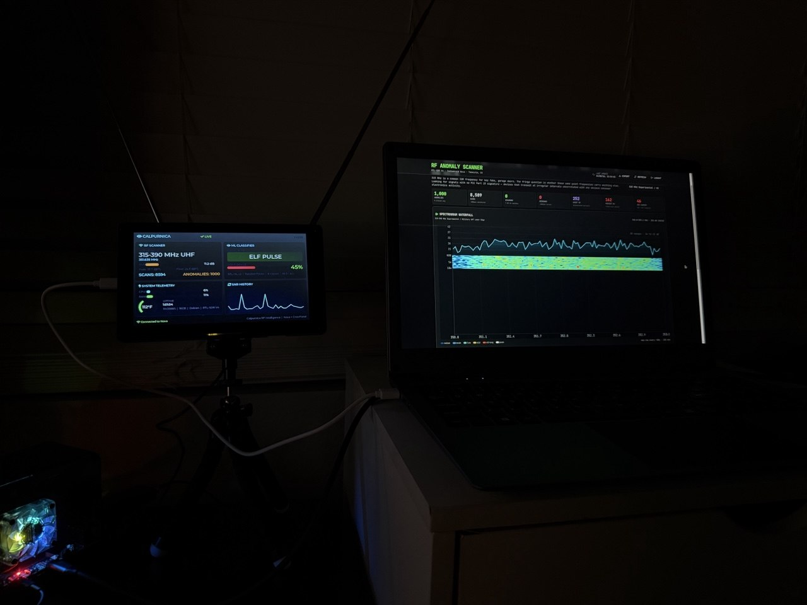
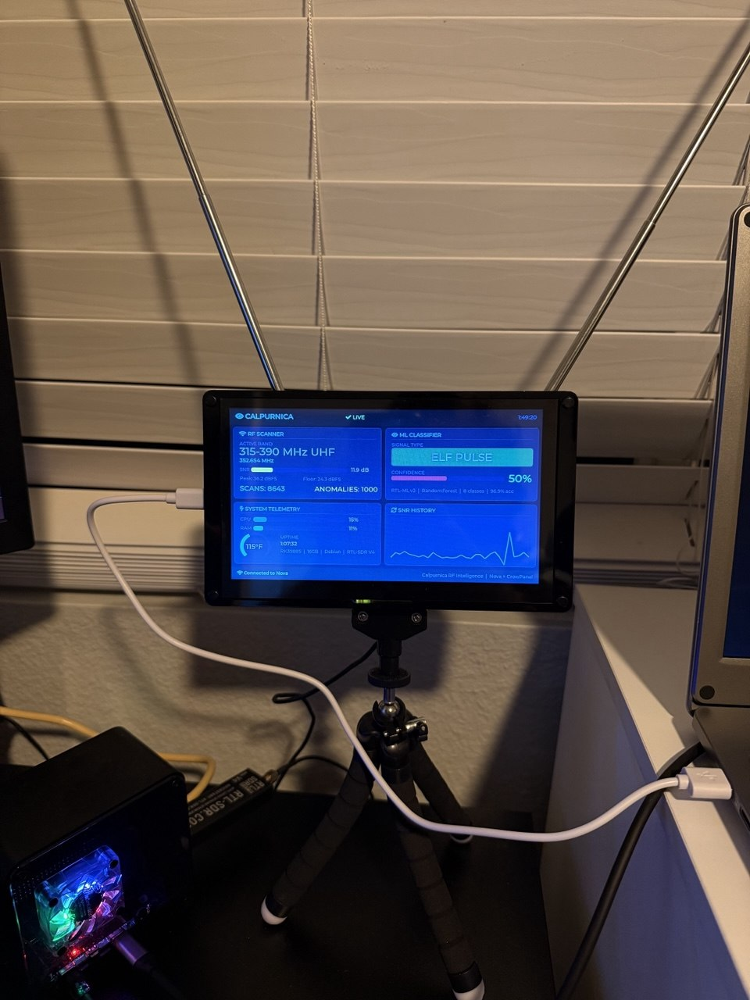
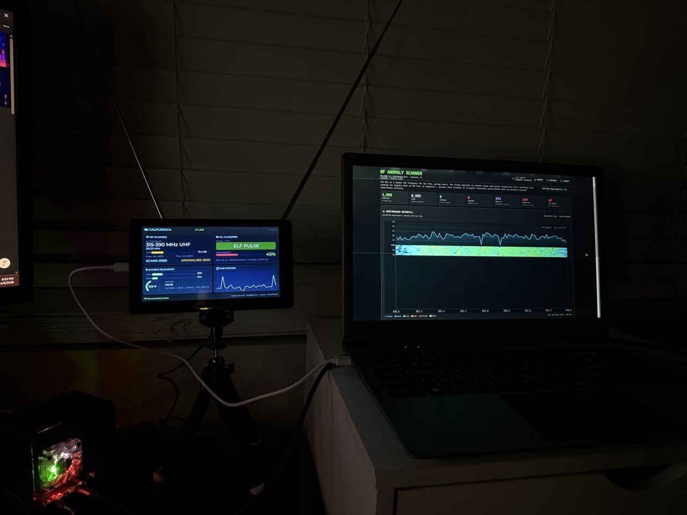
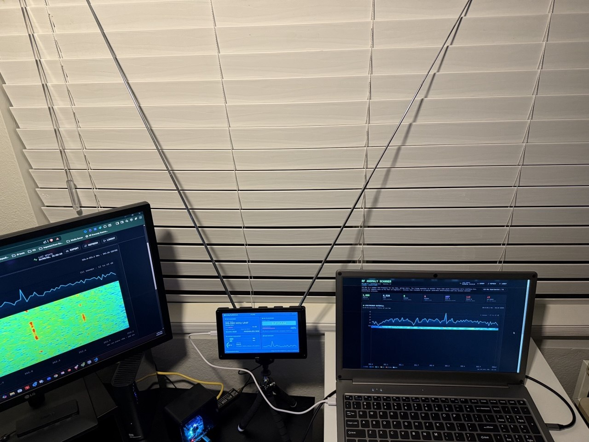

# CrowView Cyberdeck

A multi-display RF monitoring dashboard built with an **Indiedroid Nova**, **CrowPanel 7" ESP32-S3**, and **CrowView Note** portable monitor. The CrowPanel runs a custom LVGL firmware that displays real-time SDR scanning data — active band, frequency, SNR, signal classification, and system telemetry — pulled from the Nova over WiFi.



## What It Does

The CrowPanel acts as a compact heads-up display for an SDR scanning station:

- **LIVE/DEMO** status indicator
- **Active band** and real-time **frequency readout**
- **SNR bar** (color-coded) + **30-point scrolling SNR history chart**
- **ML signal classifier** with confidence percentage
- **Scan and anomaly counters**
- **System telemetry** — CPU, RAM, temperature (°F arc gauge), uptime
- Polls the Nova every 2 seconds over HTTP

The CrowView Note displays the full web dashboard with spectrum waterfall, anomaly timeline, and intelligence analysis.



## Hardware

| Component | Details |
|-----------|---------|
| **Compute** | [Indiedroid Nova](https://indiedroid.us/) — Rockchip RK3588S, 16GB LPDDR4X |
| **SDR** | RTL-SDR Blog V4 (USB) |
| **Status Display** | [CrowPanel 7.0"](https://www.elecrow.com/crowpanel-7-0-esp32-hmi-display.html) — ESP32-S3, 800×480 RGB, capacitive touch |
| **Main Display** | CrowView Note — 15.6" 1080p portable monitor (USB-C DP Alt Mode) |
| **Antenna** | Telescoping whip (pictured) |

Full parts list: [hardware/parts-list.md](hardware/parts-list.md)

## Repo Structure

```
crowview-cyberdeck/
├── crowpanel-dashboard/     # ESP32-S3 firmware (PlatformIO + LVGL + LovyanGFX)
│   ├── src/
│   │   ├── main.cpp         # Full LVGL UI + HTTP polling
│   │   └── display_driver.h # LovyanGFX RGB LCD driver
│   └── platformio.ini
├── nova-stats-sender/       # Python bridge server (runs on Nova)
│   └── stats_sender.py      # Reads scanner data, serves JSON on port 8088
├── hardware/
│   └── parts-list.md
├── images/
├── docs/
│   ├── setup-guide.md
│   └── troubleshooting.md
└── README.md
```

## Quick Start

1. **Flash the CrowPanel** — Connect via USB, build with PlatformIO:
   ```bash
   cd crowpanel-dashboard
   pio run --target upload
   ```

2. **Run the stats sender** on your Nova/Pi/SBC:
   ```bash
   python3 nova-stats-sender/stats_sender.py
   ```

3. **Connect CrowPanel to WiFi** — Edit the WiFi credentials in `main.cpp` and reflash.

4. The CrowPanel will start polling `http://<your-sbc-ip>:8088/stats` every 2 seconds.

See the full [Setup Guide](docs/setup-guide.md) for details.

## How It Works

```
[RTL-SDR V4] ──USB──▶ [Indiedroid Nova]
                            │
                       stats_sender.py
                       (port 8088)
                            │
                       WiFi HTTP GET
                            │
                    [CrowPanel ESP32-S3]
                     800×480 LVGL UI
```

The **stats sender** (`stats_sender.py`) reads live scanner output and system metrics, then serves a simple JSON endpoint. The CrowPanel firmware polls this endpoint and updates the LVGL widgets in real time.

The CrowView Note runs Chromium in kiosk mode pointing at the full web dashboard served by the Nova.

## Related Projects

- **[rtl-ml](https://github.com/TrevTron/rtl-ml)** — AI-powered radio signal classification using RTL-SDR and machine learning. The ML classifier referenced in the CrowPanel UI connects to this project.

## Tech Stack

- **CrowPanel Firmware:** C++ / Arduino framework, LVGL 8.3, LovyanGFX, ArduinoJson
- **Stats Sender:** Python 3, psutil
- **Build System:** PlatformIO (espressif32@6.5.0)
- **Display Driver:** Custom LovyanGFX class with PCA9557 I2C GPIO expander for touch reset

## Gallery

| | |
|---|---|
|  |  |
|  |  |

## License

MIT
